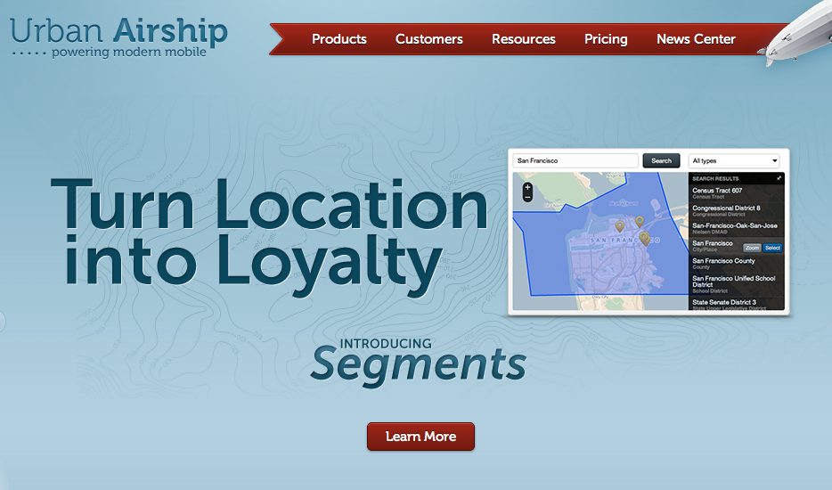
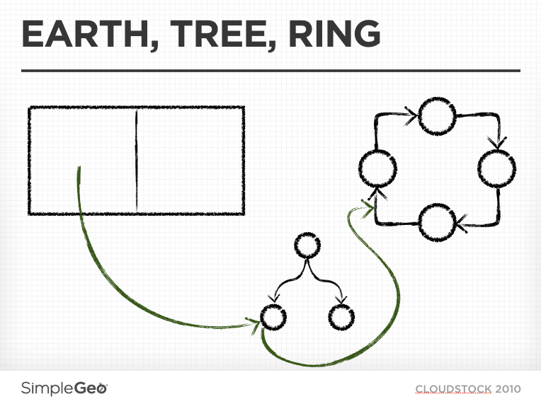

<!SLIDE title-slide>

# Herding Queries

### JOINs..

### Between Heterogeneous Datastores.. 

### Over the Network..

### What Could Possibly Go Wrong?

Mikhail Panchenko, Surge 2012

<!SLIDE bullets>

# HI!

My name is Pancakes.

<!SLIDE bullets>

## SimpleGeo Storage Platform Team

## Urban Airship Messaging Team

<!SLIDE>

# Goal:

## Location-based Push

# Bonus:

## Arbitrarily Complex Push

<!SLIDE>

# ( things nobody else has )

<!SLIDE>

<!SLIDE bullets>

# Requirements
* 
    * Instant
    * Constant, high throughput
    * Millions of devices
    * Horizontal scalability
    * All the things

<!SLIDE>

### "Perhaps you'd also like the key to the apartment

### where the money is stashed?"

<!SLIDE bullets>

# Tag Data
*  
    * Set via the API through the device SDK or directly by the developer
    * Most likely: identify interest expressed by user
        * `team:blues`
        * `likes:beyonce`
        * `dislikes:thekillers`
    * Only supported disjunctive (OR) selection
        * Useful, but limiting
        * Workarounds: `likes:beyonce_dislikes:thekillers`
            * This does not scale
    * High cardinality
        * a device can have thousands of tags (**important**)

<!SLIDE bullets>
# Location Data
* 
    * Completely new concept, lots of possibilities
        * Within N feet of Lat,Lon
        * Inside a polygon
            * City
            * Neighborhood
            * Stadium (seriously)
        * Has been in Baltimore in the last 2 weeks
    * **Recall**: SimpleGeo put a lot of effort into flexible querying of geodata.

<!SLIDE>

# CloudStock, 2010

<!SLIDE bullets>

# SimpleGeo Index Tech

*  
    * The index part of a DBMS, housed in a DHT
        * All the nice properties of the DHT
        * All the annoying properties of the DHT
    * Supports several types of trees
        * BPlusTree
        * KDtree (most used)
            * think BPlusTree with K dimensions
            * great for data with known dimensionality; flexible queries
        * RTree

<!SLIDE bullets>

# Tags and Location, Sitting in a Tree

