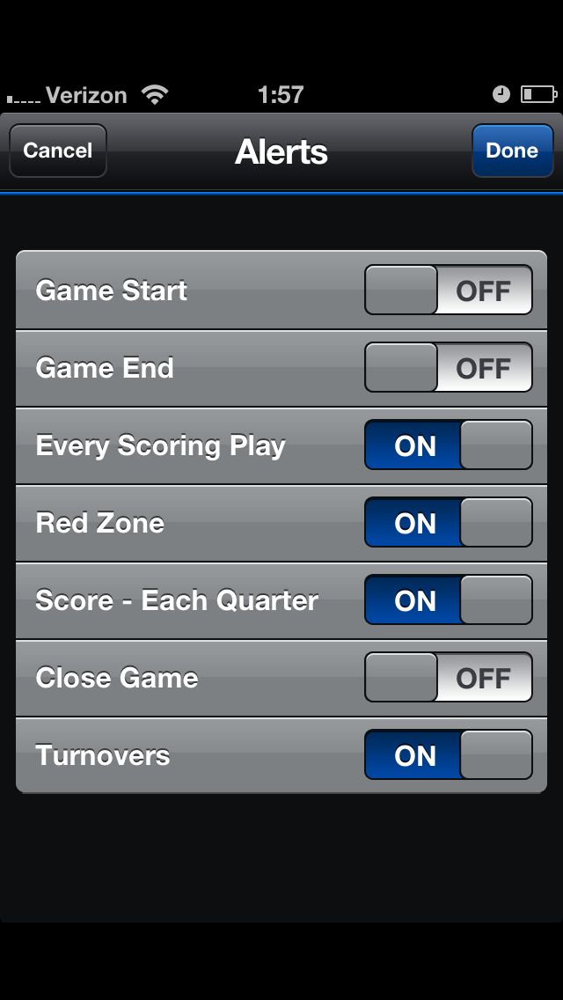
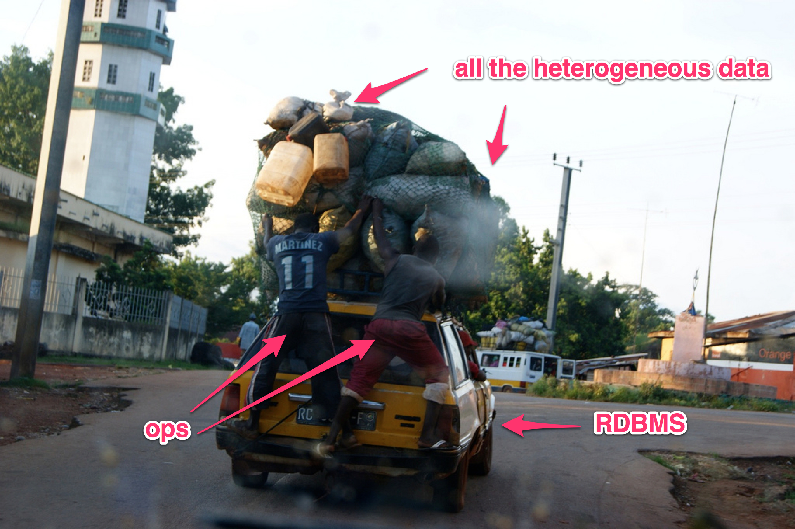
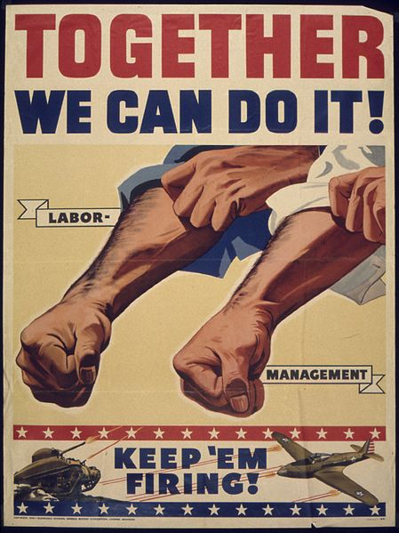
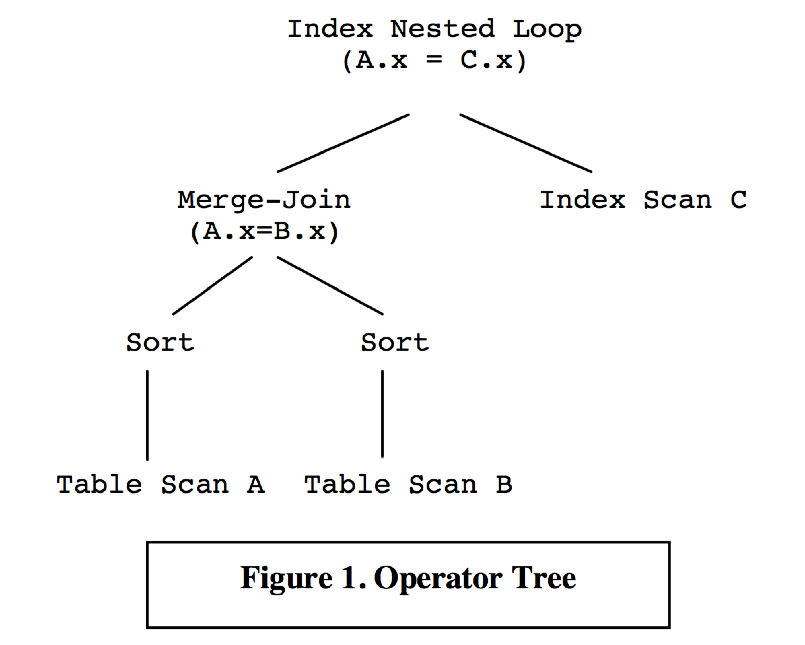
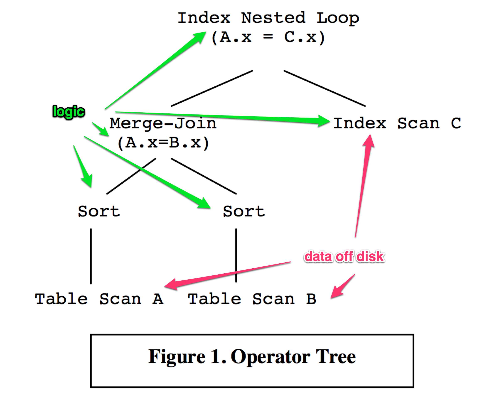
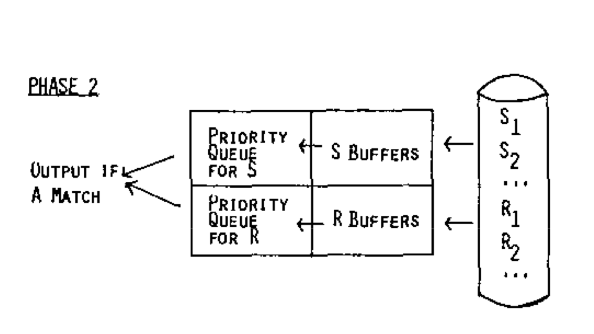
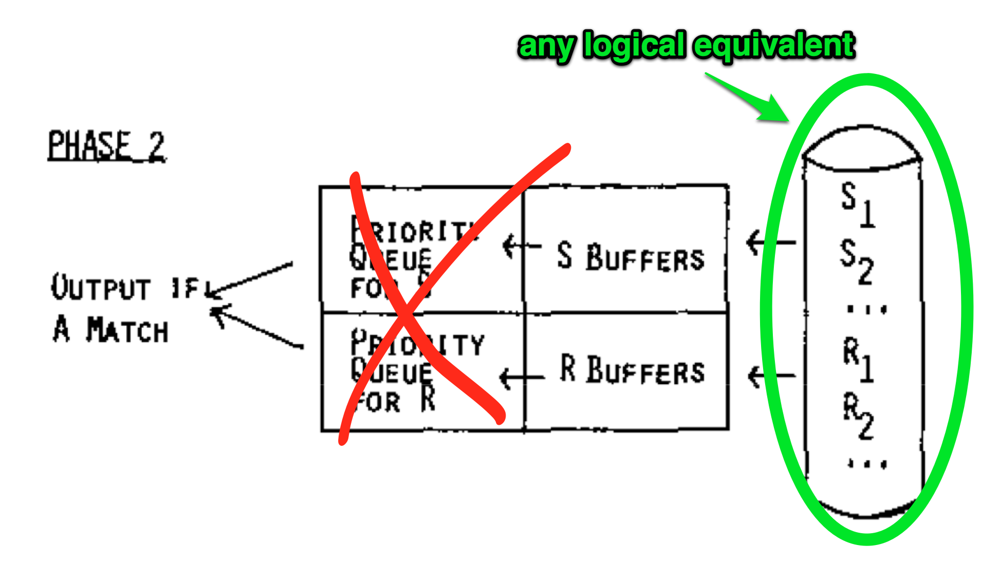

<!SLIDE title-slide>

# Herding Queries

### JOINs..

### Between Heterogeneous Datastores.. 

### Over the Network..

### What Could Possibly Go Wrong?

Mikhail Panchenko, Surge 2012

<!SLIDE bullets>

# HI!

My name is Pancakes.

<!SLIDE bullets>

## SimpleGeo Storage Platform Team

## Urban Airship Messaging Team

<!SLIDE>

# Goal: Location-based Push

### Bonus: Complex Predicate-based Push

.notes querying by location only is not very compelling on its own

<!SLIDE>

# ( very nice, but very difficult things )

<!SLIDE>

<!SLIDE bullets>

# Requirements
* 
    * Low time to first push
    * Constant, high throughput
    * Millions of devices
    * Horizontal scalability
    * All the things

<!SLIDE>

### "Perhaps you'd also like the key to the apartment

### where the money is stashed?"

<small>image credit: <a href="http://rt.com/art-and-culture/news/bender-ostap-tears-moscow/">russia today</a>

<!SLIDE bullets>

.notes famous quote.. well, famous if you're russian

# Yes, and also..

### Platform-specific data and operations

*            
    * Push platform identifying tokens
    * "quiet time"
        * can't enforce at device level on all platforms
    * "Badge" updates, etc

### Per-device lookups + updates

.notes this is a big issue - every device being sent to has to be looked up by its ID - key value read

<!SLIDE bullets>

# Tag Predicates
*  
    * Tags set via the device SDK or directly by the developer (API)
    * Most likely: identify interest expressed by user
        * `team:blues`
        * `likes:beyonce`
        * `dislikes:thekillers`

<!SLIDE bullets>

# Tag Predicates
* 
    * Only supported disjunctive (OR) selection
        * Useful, but limiting
        * Workarounds: `likes:beyonce_dislikes:thekillers`
            * This does not scale
    * High cardinality
        * a device can have thousands of tags (**important**)

.notes another example: sports app - likes team, has these specific alerts turned on

<!SLIDE>

<!SLIDE bullets>
# Location Predicates
* 
    * Completely new concept, lots of possibilities
        * Last seen inside a polygon
            * City
            * Neighborhood
            * Stadium (seriously)
        * Has been in a polygon within an interval (historic)
    * **Recall**: SimpleGeo put a lot of effort into flexible querying of geodata.

<!SLIDE>

# CloudStock, 2010

<!SLIDE bullets>

# SimpleGeo Index Tech

*  
    * The index part of a DBMS, housed in a DHT
        * All the nice properties of the DHT
        * All the annoying properties of the DHT
    * Supports several types of trees
        * BPlusTree
        * KDtree (most used)
            * think BPlusTree with K dimensions
            * great for data with known dimensionality; flexible queries
        * RTree

<!SLIDE bullets>

# Tags and Location Sitting in a Tree

*   
    * Presupposes boolean algebra
        * in SF ^ likes Dave Chappelle
        * in SF ^ ¬owns a car
        * (in SF ∨ in Oakland) ^ likes the Giants

<!SLIDE>

# "An RDBMS will do all that!"

<small>photo by <a href="http://www.flickr.com/photos/carbonnyc/4318504691">carbonnyc</a></small>

.notes pro-tip: if you blanket set all your photos to Creative Commons license, some asshole will use them for presentations

<!SLIDE>

<small>photo by <a href="http://www.flickr.com/photos/belsymington/4102783610/">belsymington</a></small>

<!SLIDE>
.notes not all RDBMSs will even do that, and the ones that do get really unwieldy at our data size

<small>photo by <a href="http://www.flickr.com/photos/belsymington/4102783610/">belsymington</a></small>

<!SLIDE>

# Tag solutions 

## don't incorporate spatial queries well

# Spatial solution

## doesn't scale to arbitrary tag cardinality

<!SLIDE>

# Don't forget the Platform-specific data!

<!SLIDE>

# How Do We Put It All Together?

<small>photo by <a href="http://www.flickr.com/photos/theotter/6590636397">theotter</a></small>

<!SLIDE>

<small>credit: <a href="http://en.wikipedia.org/wiki/We_Can_Do_It!">wikipedia</a></small>

.notes enjoy this image, because it gets heavy after this

<!SLIDE bullets>

# Let's Take Stock

*    
    * SOA - small services, good at one or two things
        * Databases suited for each use case
    * Shared RPC library
    * 100MM installs, trending towards 1B
        * &lt;10MM per customer with a few exceptions

<!SLIDE>

# Take 1

Customer -> API -> Fetch Data -> Munge -> Devices

<!SLIDE bullets>

# Scan ALL The Things

* 
    * Effectively Map-Reduce
    * An obviously non-optimal solution
    * Difficult to parallelize
    * Crippling at low cardinality

<!SLIDE>

# Take 2

Customer -> API -> Fetch Data & Munge1 -> .. -> Fetch Data & MungeN -> Devices

<!SLIDE bullets>

# Send ALL The Things

*   
    * Each step implements a 2-way "push" protocol
        * Homogeneous - lists go in, lists come out
        * Tag, location, platform pieces all act the same
    * Requires query decomposition and optimization
    * Textbook "Data to Algorithm" solution
        * (do not want)

<!SLIDE>

<small>photo by <a href="http://www.flickr.com/photos/tehf0x/">tehf0x</a></small>

<!SLIDE>

# What Would a Database Do?

.notes what would it looks like if we COULD fit it into one RDBMS?

<!SLIDE bullets>

# Vague Data Model

* 
    * Table for device location and history
        * Primary Key: **`appId:deviceId`**
    * Table for tag data
        * probably just one table and lots of self joins
        * Primary Key: **`appId:deviceId`**
    * Table for platform-specific data
        * has to be joined to everything
        * Primary Key: **`appId:deviceId`**

<!SLIDE bullets>

# Aside: Data Clustering

## An Optimization

Most RDBMSs offer this in some form.

MySQL/InnoDB does it automatically for primary keys.

**Data is stored on disk in index-order**

**Queries ordered on this index scan sequentially**

This is important.

<!SLIDE bullets>

# The Life of a Query

* 
    * Parse
    * Plan
    * Perform
    * Respond

<!SLIDE bullets>

# The Life of a Query

* 
    * Parse - turn query into an logical tree
    * **Plan** - figure out cheapest logical equivalent 
    * **Perform** - fetch, sort, merge, etc.
    * Respond - send result back to client

<!SLIDE bullets>

# Example

<small>source: [ 1 ]</small>

<!SLIDE bullets>

# Example

<small>source: [ 1 ]</small>

<!SLIDE>

## **The Logic Only Cares About Tuples**

<!SLIDE>

# How Do I JOIN?

Basic Sort Merge Join Algo from [ 2 ]

<!SLIDE bullets>

# How Do I JOIN?

* 
    * Fetch
    * Sort
    * Merge
    * Return Matches

<!SLIDE bullets>

# How Do I JOIN?

* 
    * Fetch
    * **Sort** - recall clustered keys
    * Merge
    * Return Matches

<!SLIDE>

# "Query arbitrary combinations of spatial and tag data in real time."

<!SLIDE>

# "Send to devices  matching an arbitrarily nested predicate   in any order." 

.notes those are actually quite different

<!SLIDE>

# Order by Application ID and Device ID

.notes force global ordering on disk, in queries. clustering can be taken for granted &amp; we get to skip the "sort" in sort-merge-join

<!SLIDE>

# How Do I JOIN?

Basic Sort Merge Join Algo from [ 2 ]

<!SLIDE bullets>

# So What Do We End Up With?

* 
    * Location index returns results in ID order
    * Tag index stores and returns devices in ID order
    * Platform data is stored in ID order
        * Effectively JOINed at the very end 

### Any Ordered Partitioner For Tags and Platform Data

<!SLIDE>

# All indexes support efficient cursor pagination, can skip forward

<!SLIDE>

[ rough diagram of gbc talking to databases; query execution engine -> crossed out -> gooeybuttecake ]

.notes putting a service in production called "gooeybuttercake" is my crowning achievement

