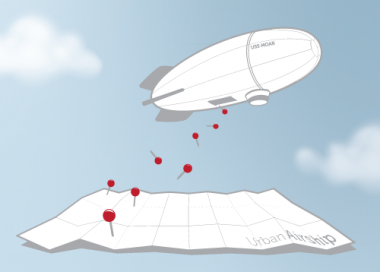

<!SLIDE title-slide>

# Herding Queries

### JOINs..

### Between Heterogeneous Datastores.. 

### Over the Network..

### What Could Possibly Go Wrong?

Mikhail Panchenko, Surge 2012

<!SLIDE bullets>

# HI!

My name is Pancakes.

<!SLIDE bullets>

## SimpleGeo Storage Platform Team

## Urban Airship Messaging Team

<!SLIDE>

# Goal:

## Location-based Push

# Bonus:

## Arbitrarily Complex Push

<!SLIDE>

# ( things nobody else has )

<!SLIDE>

<!SLIDE bullets>

# Requirements
* 
    * Instant
    * Constant, high throughput
    * Millions of devices
    * Horizontal scalability
    * All the things

<!SLIDE>

### "Perhaps you'd also like the key to the apartment

### where the money is stashed?"

